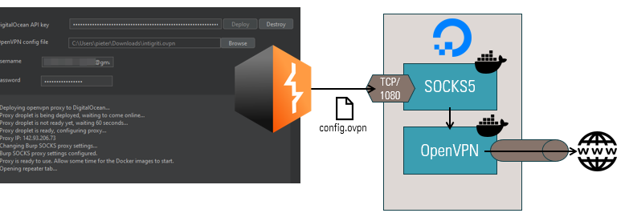
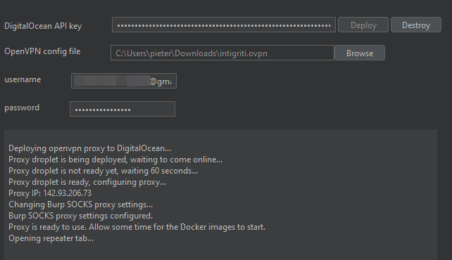

## DigitalOcean OpenVPN/SOCKS for Burp Suite

This Burp extension allows you to spin up a DigitalOcean droplet based on an OpenVPN configuration file. The droplet also functions as a SOCKS5 proxy to allow routing all Burp traffic through the VPN tunnel. The Burp proxy settings are automatically configured to route traffic through the SOCKS5 and OpenVPN droplet.

### How to use

1. Download the JAR from `build/libs/digitalocean-droplet-openvpn-all.jar` or build from source yourself;
2. Load the extension in Burp via the Extensions tab;
3. Create a DigitalOcean API token and enter your token on the extension tab "OpenVPN/SOCKS";
4. Select an OpenVPN configurataion file (.ovpn)
4. Click "Deploy" to start deploying the SOCKS and OpenVPN containers on a fresh droplet, and the extension will take care of the rest;
5. Allow up to a few minutes for the Docker image to complete installation before the proxy starts responding

### Features

* Remember your DigitalOcean API token;
* Remember your OpenVPN configuration file and credentials (optional) per project file;
* Automatically shut down the droplet when Burp closes or the extension is unloaded;
* A context menu so you can right-click > enable or disable tunnelling through the VPN
* Opens a Repeater tab to `ifconfig.co` to easily verify if the VPN is working correctly

### Potential improvements

* add an option to allow persisting the droplet when shutting down Burp to avoid the waiting time on startup - although this could result in unexpected DigitalOcean cost;
* collect feedback from the running Docker containers to help troubleshoot when things go wrong

Feel free to use the link below to set up your DigitalOcean account. If you use this referral link, you get $200 in credit, and I get $25 for every $25 you spend.

